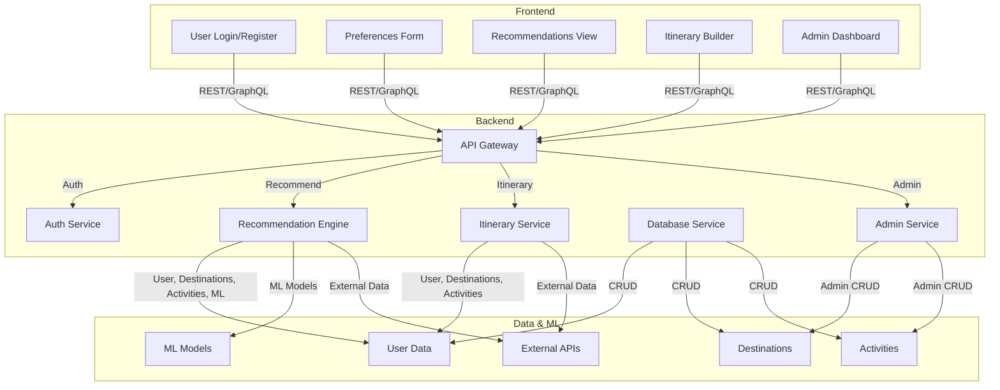

	
  
	# 🌍 Travelingo
  
	<b>Plan your next adventure with AI-powered recommendations and beautiful itineraries.</b>

A full-stack, data-driven travel recommendation system that helps users plan trips and discover destinations based on their preferences, time of year, and season.

---

## 🚀 Project Goals
- 📝 Input travel preferences, dates, and possible destinations
- 🧭 Recommend the best locations and generate personalized itineraries
- 🤖 Use data science and machine learning for smart recommendations
- 🖥️ Provide a modern, user-friendly web interface

---

## 🏆 Key Features
- 🔒 User authentication and profile management
- 🌐 Destination and activity database
- 🧠 Intelligent recommendation engine (season-aware)
- 🗺️ Itinerary planner
- 📱 Responsive frontend UI
- 🚢 Deployable with CI/CD and Docker

---

## 👤 Initial User Stories
- 🙋‍♂️ As a user, I want to enter my travel preferences and dates so I can get personalized recommendations.
- 🌴 As a user, I want to see the best destinations for my chosen season.
- 📝 As a user, I want to view and edit my generated itinerary.
- 🛠️ As an admin, I want to manage destinations and activities in the system.

---

## 🧰 Tech Stack (Proposed)
- 🎨 Frontend: React (or Vue)
- 🐍 Backend: Python (Flask/Django) or Node.js
- 🗄️ Database: PostgreSQL or MongoDB
- 📊 ML/Data Science: Python (scikit-learn, pandas, etc.)
- 🚀 Deployment: Docker, GitHub Actions, cloud provider (Azure/AWS/Heroku)

---

## ⏭️ Next Steps
- 📋 Gather detailed requirements and refine user stories
- 🏗️ Set up backend and frontend frameworks
- 🗂️ Design database schema
- 🛠️ Build MVP for user input and recommendations

---

---

---

## 🗺️ System Architecture

---

---

### ✨ Design Principles
- 🎨 **Beautiful UI:** Gradients, icons, smooth transitions
- 🧑‍💻 **Professional:** Clean layouts, clear navigation, consistent branding
- 😎 **Cool Features:**
	- 🗺️ Interactive maps
	- 🎬 Animated recommendations
	- 🧩 Drag-and-drop itinerary builder

---

---

### 🎨 UI Inspiration
- [Dribbble Travel App UI](https://dribbble.com/tags/travel_app)
- [Behance Travel Dashboard](https://www.behance.net/search/projects?search=travel%20dashboard)

---

---

> For more detailed requirements, see [`docs/requirements.md`](docs/requirements.md).
