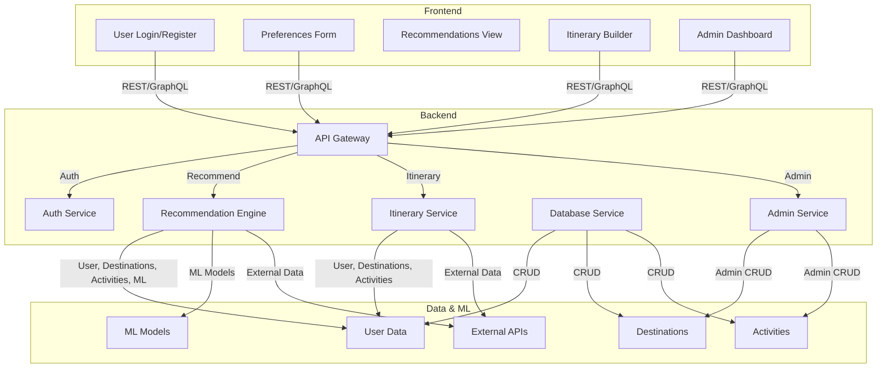

  
# 🌍 Travelingo
  
A full-stack, data-driven travel recommendation system that helps users plan trips and discover destinations based on their preferences, time of year, and season.


---

## 🚀 Project Goals
- 📝 Input travel preferences, dates, and possible destinations
- 🧭 Recommend the best locations and generate personalized itineraries
- 🤖 Use data science and machine learning for smart recommendations
- 🖥️ Provide a modern, user-friendly web interface


---

## 🏆 Key Features


## 👤 Initial User Stories


## 🧰 Tech Stack (Current)


> See `requirements.txt` and `package.json` for full dependency lists.


## ⏭️ Next Steps

---

## 🖥️ Frontend Setup (React + TypeScript)

The frontend is located in the `frontend` directory and built with React and TypeScript.

### 🚦 To run the frontend locally:

```sh
cd frontend
npm install
npm start
```


```sh
npm run build
```

---

---


---


---

## 🗺️ System Architecture


```mermaid
flowchart TD
		subgraph Frontend
			A1[User Login/Register]
			A2[Preferences Form]
			A3[Recommendations View]
			A4[Itinerary Builder]
			A5[Admin Dashboard]
		end
		subgraph Backend
			B1[API Gateway]
			B2[Auth Service]
			B3[Recommendation Engine]
			B4[Itinerary Service]
			B5[Database Service]
			B6[Admin Service]
		end
		subgraph Data & ML
			C1[User Data]
			C2[Destinations]
			C3[Activities]
			C4[ML Models]
			C5[External APIs]
		end

		A1-->|REST/GraphQL|B1
		A2-->|REST/GraphQL|B1
		A4-->|REST/GraphQL|B1
		A5-->|REST/GraphQL|B1
		B1-->|Auth|B2
		B1-->|Recommend|B3
		B1-->|Itinerary|B4
		B1-->|Admin|B6
		B3-->|User, Destinations, Activities, ML|C1
		B3-->|ML Models|C4
		B4-->|User, Destinations, Activities|C1
		B5-->|CRUD|C1
		B5-->|CRUD|C2
		B5-->|CRUD|C3
		B6-->|Admin CRUD|C2
		B6-->|Admin CRUD|C3
		B3-->|External Data|C5
		B4-->|External Data|C5
```

---


---

### ✨ Design Principles
- 🎨 **Beautiful UI:** Gradients, icons, smooth transitions
- 🧑‍💻 **Professional:** Clean layouts, clear navigation, consistent branding
- 😎 **Cool Features:**
	- 🗺️ Interactive maps
	- 🎬 Animated recommendations
	- 🧩 Drag-and-drop itinerary builder

---


---

### 🎨 UI Inspiration
- [Dribbble Travel App UI](https://dribbble.com/tags/travel_app)
- [Behance Travel Dashboard](https://www.behance.net/search/projects?search=travel%20dashboard)

---


---

> For more detailed requirements, see [`docs/requirements.md`](docs/requirements.md).
